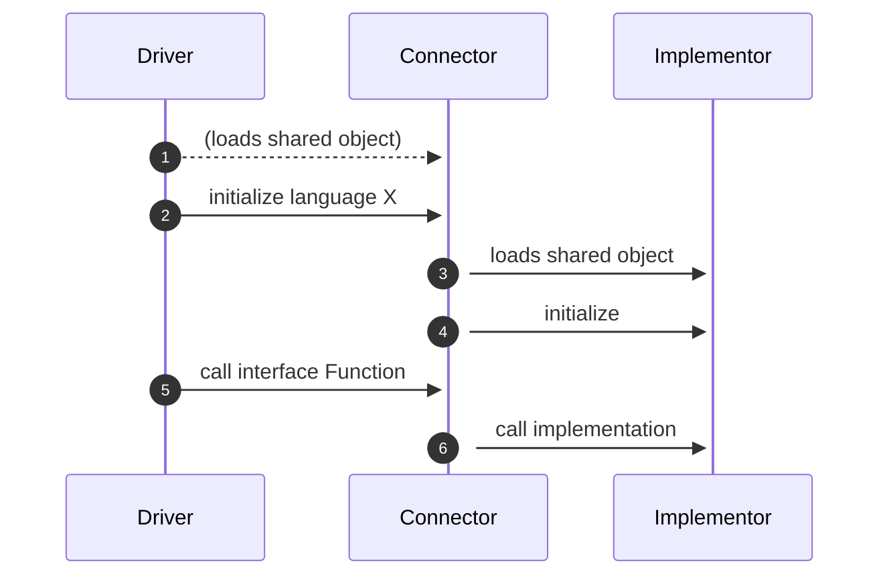
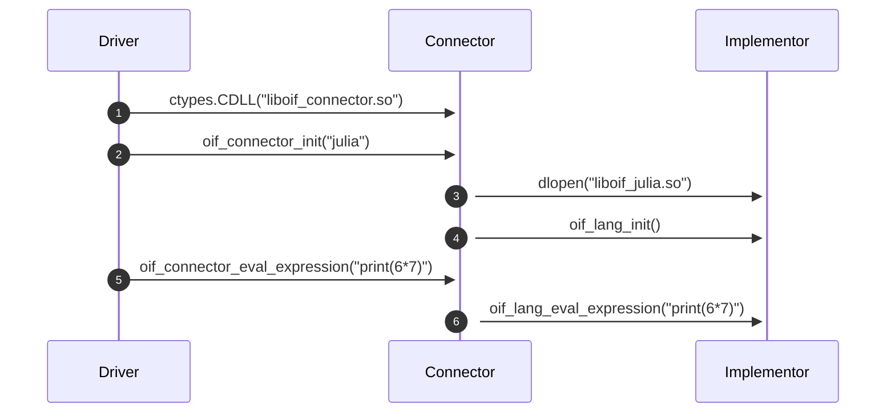

# Progress Update TA2 M1+2

<small>René Fritze</small>

<small>rene.fritze@wwu.de</small>

<small>Applied Mathematics Münster</small>

<small>Jul 12th, 2022</small>

<small>*MaRDI Tuesday*</small>

---

# Open Interfaces (M2) Goals

- develop and establish open interface standards
- interconnect disparate numerical softwares
- provide abstractions for the benchmark framework in M3

---

## Prototype Project Setup


- Connector is a C library
- Driver isolated from Implementor
- Drivers can be script-like (Python) or binary-like (C++)

---

## Prototype

# Runtime



---

# Drivers and Implementors available in

- C
- C++
- Python
- Julia
- R

---

# API Design

```C
// Connector's interface
int oif_connector_init(const char *lang);
int oif_connector_eval_expression(const char *str);
void oif_connector_deinit();
```

---

# API Design

```C
// Implementor's interface
int oif_lang_init();
int oif_lang_eval_expression(const char *str);
void oif_lang_deinit();
```

---

# Python -> Julia Example


