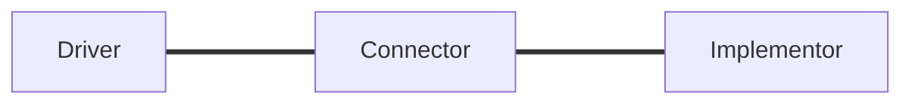
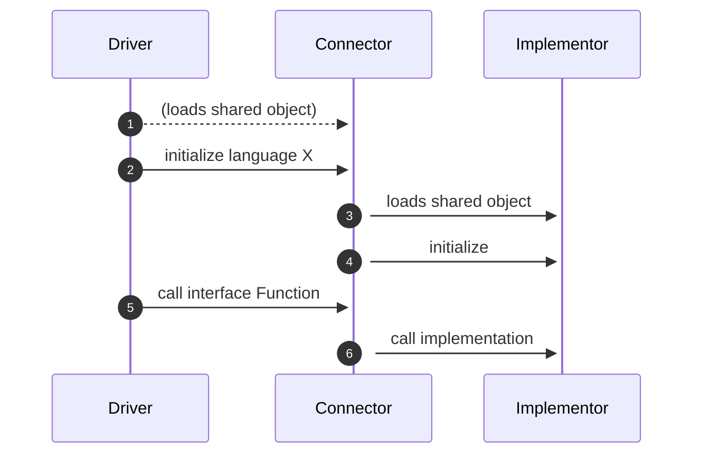

# Progress Update

## Task Area 2 ‒ Measure 2

<small>rene.fritze@wwu.de</small>

<small>Applied Mathematics Münster</small>

<small>*MaRDI Tuesday* ‒ July 12th, 2022</small>

<small></small>

---

# Open Interfaces (M2) Goals

- develop and establish open interface standards
- interconnect disparate numerical softwares
- provide abstractions for the benchmark framework in M3

---

## Prototype Project Setup



---

## Prototype Project Setup

- Connector is a C library
- Driver isolated from Implementor
- Drivers can dynamically load or statically link against Connector
- Connector dynamically loads Implementor

---

## Runtime flow



---

# Available Drivers and Implementors

- C
- C++
- Python
- Julia
- R

---

# API Design

```C
// Connector's interface (What the Drivers see)
int oif_connector_init(const char *lang);
int oif_connector_eval_expression(const char *str);
int oif_connector_solve(int N, const double *const A,
                      const double *const b, double *x);
void oif_connector_deinit();
```

---

# API Design

```C
// Implementor's interface (What the Connector sees)
int oif_lang_init();
int oif_lang_eval_expression(const char *str);
int oif_lang_solve(int N, const double *const A,
                   const double *const b, double *x);
void oif_lang_deinit();
```

<!-- ---

# Python -> Julia Example

```mermaid
sequenceDiagram
  autonumber
  participant Driver
  participant Connector
  participant Implementor

  Driver ->>+ Connector: ctypes.CDLL("liboif_connector.so")
  Driver ->>+ Connector: oif_connector_init("julia")
  Connector ->>+ Implementor: dlopen("liboif_julia.so")
  Connector ->>+ Implementor: oif_lang_init()
  Driver ->>+ Connector: oif_connector_eval_expression("print(6*7)")
  Connector ->>+ Implementor: oif_lang_eval_expression("print(6*7)")
``` -->

---

# Misc

- Testing all Driver -> Implementor Combinations (with pytest)
- Documentation Setup (Sphinx + Doxygen via breathe)
